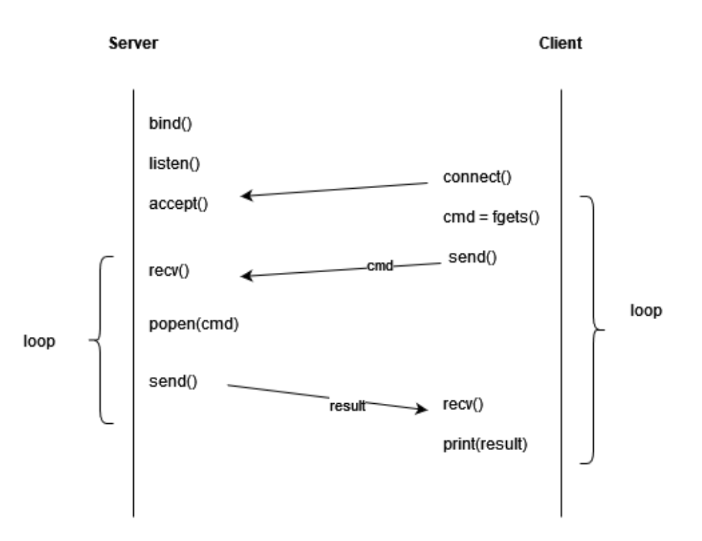

# Reverse shell in C using socket programming

The goal of this project is to realize a reverse shell in C using socket programming. In order to do this, we need to use the concept of the client/server relationship with the TCP network protocol. 

