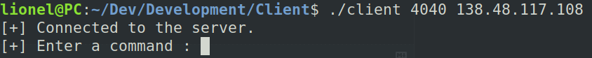

# Reverse shell in C using socket programming

The project concerns the realization of a reverse shell in C using socket programming. In order to do this, we need to use the concept of the client/server relationship with the TCP network protocol

## Disclamer

This project is carried out in the context of a course and is only made public for educational purpose. Any unauthorized use of this software for malicious purposes may be punishable by law

## Getting started

To start the server, you need to specify two arguments : **Port number** | **IP address**

```console
$ ./server port_number IP_address
```

Once started, the server will wait for the client to connect and if it connects it will display the client's ip address


To start the client, you need to do the same thing that for the server

```console
$ ./client port_number IP_address
```
Once started, the client will connect to the server using a socket and will wait for the user's input to execute a bash command



When a command is written by the user, the client will send the TCP request to the server which will execute it and return the result


To stop the connection between the client and the server, you can use the **_quit_** command. This command will close the socket.


## Network traffic capture

We can check with tool [Wireshark](https://github.com/wireshark/wireshark) that our TCP packets are well exchanged between the server and the client


